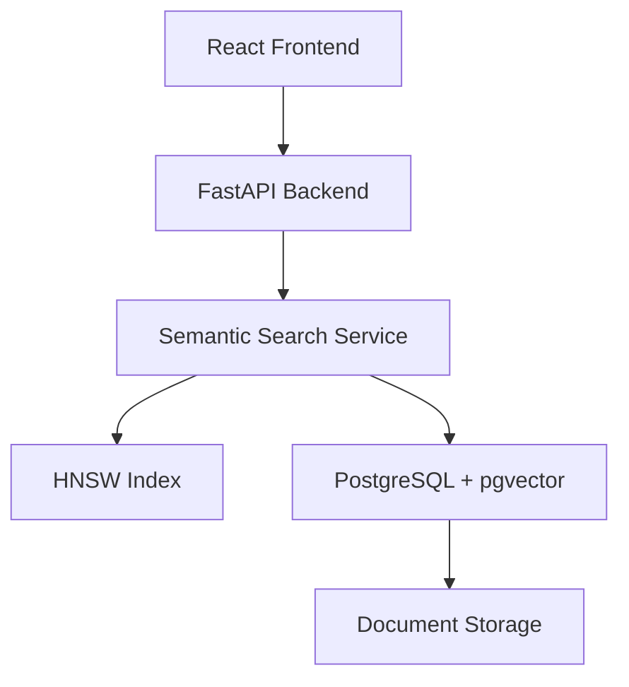

# Vector Search Engine

A high-performance semantic search engine that leverages vector embeddings, PostgreSQL, HNSW-based Approximate Nearest Neighbor (ANN) indexing, and FastAPI to provide fast and scalable document retrieval.

## Overview

Traditional keyword-based search systems rely on exact word matches, which often fail to capture semantic meaning. This project implements a Vector Search Engine capable of understanding the meaning of text using embeddings and retrieving the most relevant documents through vector similarity search.

The system supports document ingestion, embedding generation, vector storage, semantic retrieval, HNSW indexing, benchmarking, and a React-based user interface.

## Features

### Core Features

* Document ingestion pipeline
* Embedding generation using Sentence Transformers
* PostgreSQL-based vector storage
* Semantic similarity search
* FastAPI REST API
* React frontend for search and document management

### Advanced Features

* HNSW (Hierarchical Navigable Small World) Approximate Nearest Neighbor indexing
* Incremental index updates
* Persistent index storage
* Benchmarking suite for ANN evaluation
* Automated test suite
* Dockerized deployment support

## System Architecture



## Technology Stack

### Backend

* Python
* FastAPI
* PostgreSQL
* SQLAlchemy
* pgvector

### Machine Learning

* Sentence Transformers
* Vector Embeddings

### Search & Indexing

* HNSWLib
* Cosine Similarity Search

### Frontend

* React
* Vite

### Infrastructure

* Docker
* Docker Compose

### Testing

* Pytest

## Project Structure

```text
vector-search-engine/
│
├── frontend/           # React frontend
├── src/                # Backend source code
├── tests/              # Automated tests
├── benchmarks/         # Benchmarking suite
├── docker/             # Docker configuration
├── docs/               # Documentation
├── config/             # Configuration files
│
├── docker-compose.yml
├── requirements.txt
└── README.md
```

## Search Workflow

1. User uploads a document.
2. The document is converted into embeddings.
3. Embeddings are stored in PostgreSQL.
4. HNSW index is updated.
5. User submits a search query.
6. Query is embedded.
7. Similar vectors are retrieved.
8. Matching documents are returned ranked by similarity.

## Benchmarking

The project includes a benchmarking framework that compares:

* Brute-force vector search
* HNSW Approximate Nearest Neighbor search

Metrics evaluated:

* Search latency
* Throughput
* Recall@K

This allows performance analysis and demonstrates the effectiveness of ANN indexing compared to exhaustive search.

## Running Locally

### Backend

```bash
pip install -r requirements.txt
python -m pytest
uvicorn src.api:app --reload
```

### Frontend

```bash
cd frontend
npm install
npm run dev
```

## Test Results

Current automated test suite:

```text
22 tests passed
```

The tests cover:

* Document ingestion
* Repository operations
* Search functionality
* API endpoints
* HNSW indexing
* Benchmark validation

## Future Improvements

* Hybrid keyword + vector search
* Multi-user support
* Distributed indexing
* Advanced metadata filtering
* Query analytics dashboard
* Reranking models
* Cloud-native deployment

## Learning Outcomes

This project provided hands-on experience with:

* Database system design
* Vector databases
* Approximate Nearest Neighbor algorithms
* API development
* Full-stack integration
* Performance benchmarking
* Software testing
* Git and GitHub workflows

## License

MIT License
